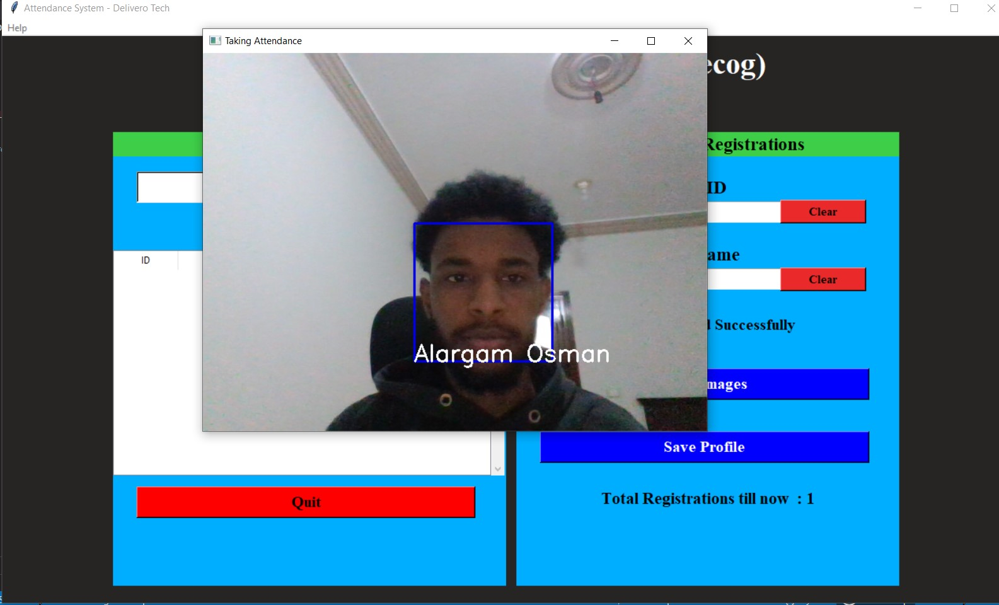
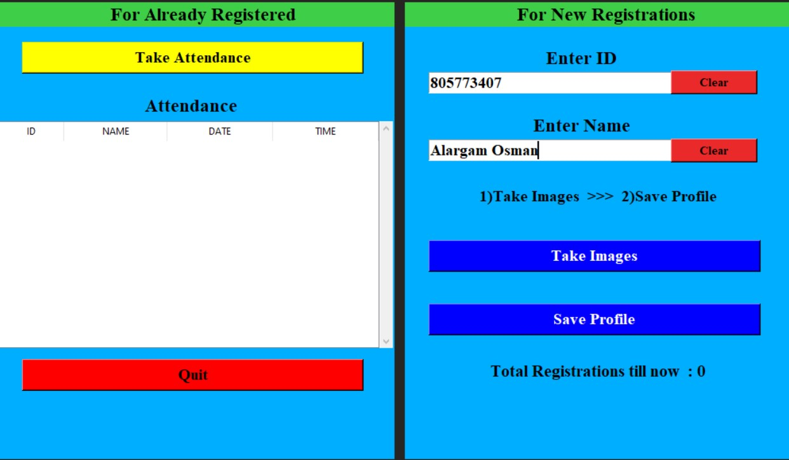
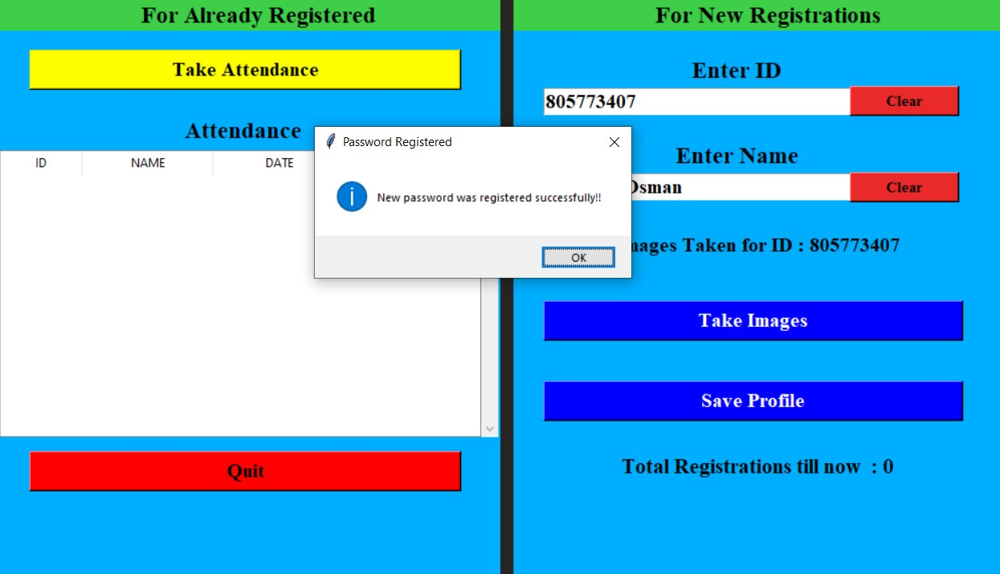

# 📸 Smart Face Recognition Attendance System


A robust and efficient desktop application that leverages **Computer Vision** and **Machine Learning** to automate the attendance process. This system replaces traditional manual methods with a contactless, secure, and fast face recognition solution.

---

## 🚀 Features

* **🖥️ User-Friendly GUI:** Built with `tkinter`, providing a clean and intuitive interface for both admins and users.
* **🔒 Admin Security:** Password-protected registration module to prevent unauthorized data access or model retraining.
* **⚡ Real-Time Detection:** Instantly detects and recognizes faces using the **LBPH (Local Binary Patterns Histograms)** algorithm.
* **📊 Automated Logging:** Automatically generates daily CSV/Excel files containing ID, Name, Date, and Time for every attendee.
* **📂 Dynamic Database:** Auto-creates necessary directories and manages image datasets without manual configuration.
* **📈 Live Updates:** Displays attendance status in real-time on the main dashboard.

---

## 🛠️ Tech Stack

* **Language:** Python 3.x
* **Core Library:** OpenCV (`opencv-contrib-python`) for face detection and recognition.
* **Data Handling:** Pandas & Numpy for managing CSV logs and array manipulations.
* **Interface:** Tkinter (Standard Python GUI).
* **Image Processing:** Pillow (PIL).

---

## 📸 Screenshots

### 1. Main Dashboard & Real-time Tracking
The system detects the face, matches it with the trained model, and marks attendance instantly.


### 2. New User Registration
Simple interface to capture dataset images for new employees/students.


### 3. Admin Security Setup
First-time setup requires creating a secure password for the admin panel.


### 4. Training Confirmation
After capturing images, the model trains on the dataset to ensure high accuracy.


---

## ⚙️ Installation & Setup

1.  **Clone the Repository:**
    ```bash
    git clone [https://github.com/alargam/Smart-Face-Recognition-Attendance-System.git](https://github.com/alargam/Smart-Face-Recognition-Attendance-System.git)
    cd Smart-Face-Recognition-Attendance-System
    ```

2.  **Install Dependencies:**
    Make sure you have Python installed, then run:
    ```bash
    pip install opencv-contrib-python numpy pandas pillow
    ```

3.  **Run the Application:**
    ```bash
    python main.py
    ```

> **Note:** The system will automatically generate the required folders (`TrainingImage`, `StudentDetails`, etc.) upon the first run.

---

## 📖 How to Use

1.  **Register a New User:**
    * Enter a numeric **ID** and **Name**.
    * Click **"Take Images"** (The webcam will capture 60 samples).
    * Click **"Save Profile"** (Enter the admin password to train the model).
2.  **Take Attendance:**
    * Click **"Take Attendance"**.
    * The camera will open; simply look at it.
    * Press `q` to exit the camera window.
3.  **Check Reports:**
    * Go to the `Attendance` folder to find the daily CSV file (e.g., `Attendance_25-10-2025.csv`).

---

## 📂 Project Structure

├── Attendance/           # Stores daily attendance CSV files
├── StudentDetails/       # Stores the list of registered users
├── TrainingImage/        # Raw dataset images (captured faces)
├── TrainingImageLabel/   # Saved trained model (Trainner.yml) & Password
├── haarcascade_...xml    # Pre-trained face detection model
├── main.py               # Main source code
├── README.md             # Project Documentation
├── requirements.txt      # List of dependencies
└── image/                # Contains project images

---

## 👨‍💻 Author

**Alargam Mohamed**
* **Role:** AI & Computer Vision Engineer
* **GitHub:** [github.com/alargam](https://github.com/alargam)

---

*This project is open-source and available under the MIT License.*
